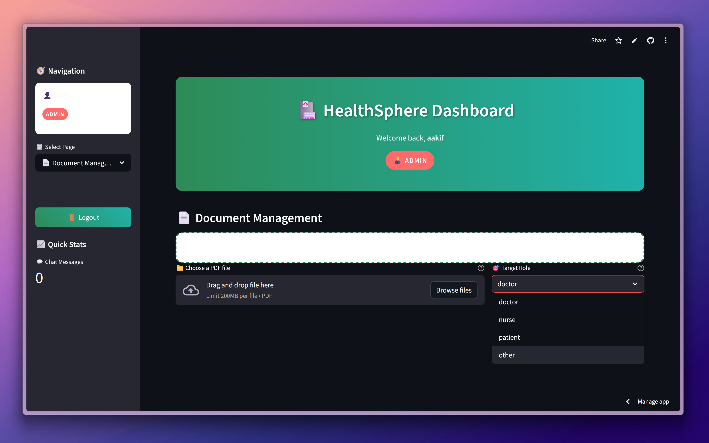
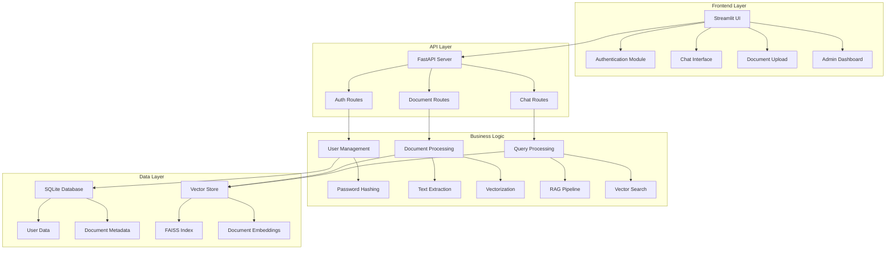
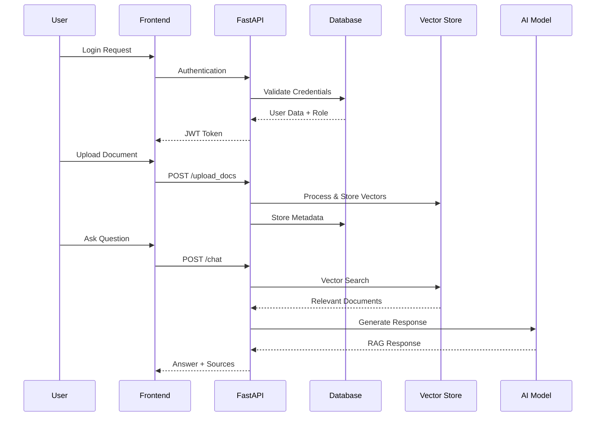
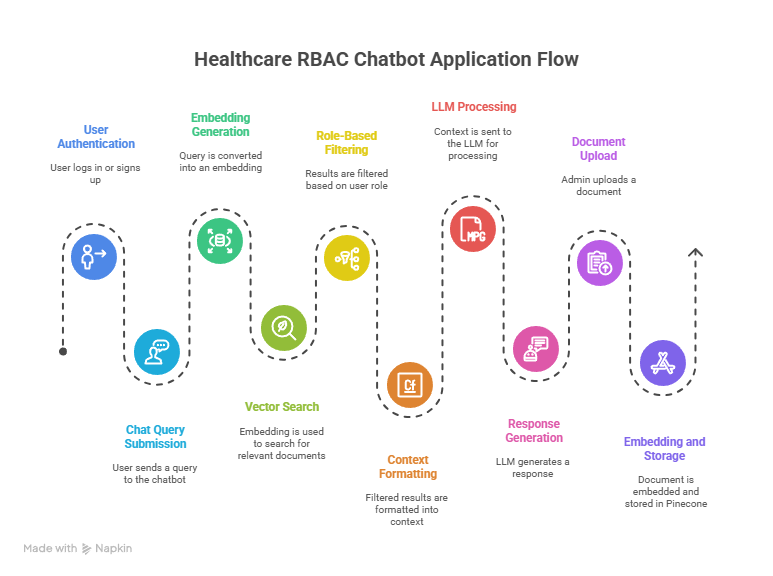
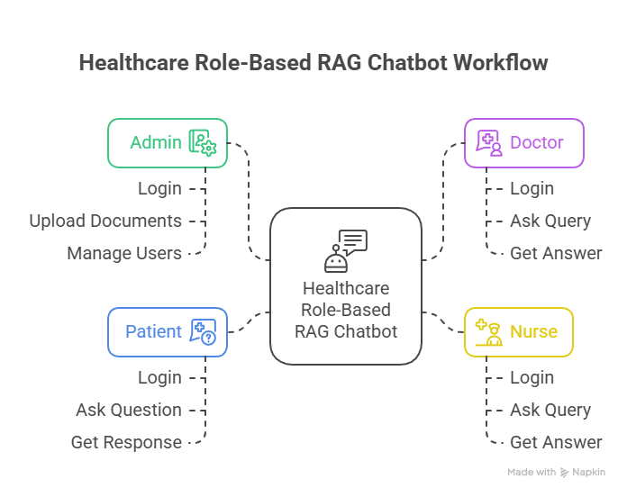

<div align="center">

# 🏥 HealthSphere

[](https://python.org)
[](https://fastapi.tiangolo.com)
[](https://streamlit.io)
[](LICENSE)

> **Revolutionizing healthcare documentation with AI-powered insights and role-based access control**



</div>


## 🎯 Project Overview

HealthSphere is an advanced healthcare document management system that combines **Retrieval-Augmented Generation (RAG)** with **Role-Based Access Control (RBAC)** to provide intelligent, contextual responses to medical queries. The system enables healthcare professionals to interact with vast amounts of medical documentation through natural language processing, while ensuring proper access controls based on user roles.

## 🚀 Why HealthSphere?

### 🏥 Healthcare Challenges Addressed

| Challenge | HealthSphere Solution |
|-----------|----------------------|
| **Information Overload** | AI-powered document summarization and intelligent search |
| **Access Control Issues** | Granular role-based permissions for sensitive medical data |
| **Time-Consuming Research** | Instant retrieval of relevant medical information |
| **Knowledge Fragmentation** | Unified platform combining multiple medical document sources |
| **Compliance Requirements** | Built-in RBAC ensuring regulatory compliance |

### 🎯 Key Benefits

- **🔍 Enhanced Decision Making**: Quick access to relevant medical information
- **⚡ Improved Efficiency**: Reduce time spent searching through documents
- **🛡️ Secure by Design**: Role-based access ensures data protection
- **📚 Comprehensive Knowledge Base**: Centralized medical document repository
- **🤖 AI-Powered Insights**: Intelligent responses with source attribution

---

## 🏗️ Technical Architecture

### 🏛️ **System Architecture**



### 🔄 **Data Flow Architecture**



---

## 📊 System Diagrams

<details>
<summary>🔄 <strong>Application Flow Diagram</strong> (Click to expand)</summary>



This diagram illustrates the complete user journey through the HealthSphere application, showing how different user roles interact with various system components from authentication to document retrieval.

</details>

<details>
<summary>🧩 <strong>Core Modules Architecture</strong> (Click to expand)</summary>



This diagram shows the internal architecture of HealthSphere, detailing how the core modules interact with each other, including the authentication system, document processing pipeline, and RAG implementation.

</details>

---

## 🛠️ Technology Stack

### 🖥️ **Backend Technologies**
- **🐍 Python 3.11+**: Core programming language
- **⚡ FastAPI**: High-performance web framework
- **🗄️ MongoDB**: Database for user management
- **🔐 bcrypt**: Password hashing and security
- **📚 LangChain**: LLM orchestration framework
- **🔍 FAISS**: Vector similarity search
- **📄 PyPDF2**: PDF text extraction
- **🤖 Gemini**: Language model for responses

### 🎨 **Frontend Technologies**
- **🎛️ Streamlit**: Interactive web application framework
- **🎨 Custom CSS**: Enhanced UI/UX design
- **📱 Responsive Design**: Mobile-friendly interface
- **🔄 Session Management**: Stateful user interactions

### 🔧 **Development Tools**
- **📦 uv**: Fast Python package manager
- **🐳 Virtual Environments**: Isolated development environments
- **🔄 Hot Reload**: Development efficiency tools
- **📝 Type Hints**: Code quality and documentation

---

## ⚙️ Installation Guide

### 📋 **Prerequisites**
- Python 3.11 or higher
- Git for version control
- OpenAI API key (for AI responses)

### 🚀 **Quick Start**

1. **Clone the Repository**
   ```bash
   git clone https://github.com/aakifnehal/HealthSphere.git
   cd HealthSphere
   ```

2. **Backend Setup**
   ```bash
   cd server
   python -m venv .venv
   
   # Windows
   .venv\Scripts\activate
   
   # Linux/Mac
   source .venv/bin/activate
   
   # Install dependencies
   uv pip install -r requirements.txt
   ```

3. **Frontend Setup**
   ```bash
   cd ../client
   python -m venv .venv
   
   # Windows
   .venv\Scripts\activate
   
   # Linux/Mac
   source .venv/bin/activate
   
   # Install dependencies
   uv pip install -r requirements.txt
   ```

4. **Environment Configuration**
   ```bash
   # Create .env file in both client and server directories
   echo "API_URL=http://localhost:8000" > client/.env
   echo "OPENAI_API_KEY=your_openai_api_key_here" > server/.env
   ```

5. **Run the Application**
   ```bash
   # Terminal 1: Start Backend
   cd server
   uvicorn main:app --reload --port 8000
   
   # Terminal 2: Start Frontend
   cd client
   streamlit run main.py --server.port 8501
   ```

6. **Access the Application**
   - Frontend: http://localhost:8501
   - Backend API: http://localhost:8000
   - API Documentation: http://localhost:8000/docs

---

## 🔐 Role-Based Access Control

### 👥 **User Roles & Permissions**

| Role | Document Upload | Document Access | Chat Access | Admin Features |
|------|----------------|----------------|-------------|---------------|
| **👨‍💼 Admin** | ✅ All documents | ✅ All documents | ✅ Full access | ✅ User management |
| **👨‍⚕️ Doctor** | ❌ | ✅ Doctor-specific | ✅ Medical queries | ❌ |
| **👩‍⚕️ Nurse** | ❌ | ✅ Nurse-specific | ✅ Care-related queries | ❌ |
| **🏥 Patient** | ❌ | ✅ Patient education | ✅ Basic health info | ❌ |
| **👤 Other** | ❌ | ✅ General health | ✅ General queries | ❌ |

### 🛡️ **Security Features**
- **Password Hashing**: bcrypt with salt rounds
- **Session Management**: Secure session handling
- **API Authentication**: HTTP Basic Auth for API calls
- **Input Validation**: Comprehensive request validation
- **Error Handling**: Secure error responses

---

## 🔄 API Endpoints

### 🔐 **Authentication Endpoints**
```http
GET /login
POST /signup
```

### 📄 **Document Management**
```http
POST /upload_docs    # Admin only - Upload documents with role assignment
GET /documents       # Get accessible documents for current user
```

### 💬 **Chat Interface**
```http
POST /chat           # Send query and get AI response with sources
```

### 📊 **Health Check**
```http
GET /                # API health status
```

---

## 📱 Usage Examples

### 👨‍⚕️ **Doctor Query Example**
```
Query: "What are the latest treatment protocols for hypertension in elderly patients?"

Response: Based on the uploaded medical guidelines, here are the current treatment protocols:
1. First-line treatment: ACE inhibitors or ARBs
2. Target BP: <130/80 mmHg for most patients
3. Consider thiazide diuretics as second-line...

Sources:
- Hypertension_Guidelines_2024.pdf (Page 15-18)
- Elderly_Care_Protocols.pdf (Page 22)
```

### 👩‍⚕️ **Nurse Query Example**
```
Query: "What are the post-operative care instructions for cardiac surgery patients?"

Response: Post-operative cardiac care includes:
1. Vital signs monitoring every 15 minutes initially
2. Pain assessment using standardized scales
3. Wound care and infection prevention...

Sources:
- Cardiac_Surgery_Nursing.pdf (Page 45-52)
- Post_Op_Care_Standards.pdf (Page 12)
```

---

## 📄 License

This project is licensed under the MIT License - see the [LICENSE](LICENSE) file for details.

---

## 🙏 Acknowledgments

- **OpenAI** for providing the GPT models
- **LangChain** community for the RAG framework
- **Streamlit** team for the amazing UI framework
- **FastAPI** community for the robust backend framework

---

## 📞 Contact

**Aakif Nehal** - [@aakifnehal](https://github.com/aakifnehal)

Project Link: [https://github.com/aakifnehal/HealthSphere](https://github.com/aakifnehal/HealthSphere)

---

<div align="center">

### 🏥 **HealthSphere - Transforming Healthcare Documentation** 🏥

*Made with ❤️ for better healthcare outcomes*

</div>